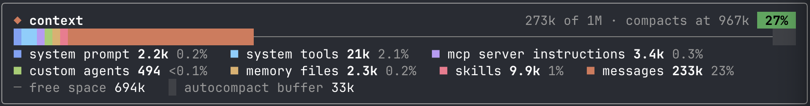
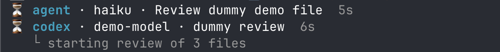
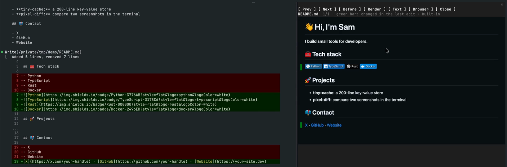
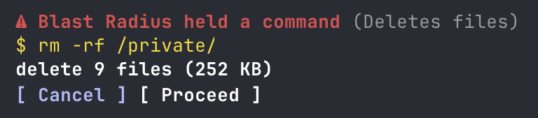
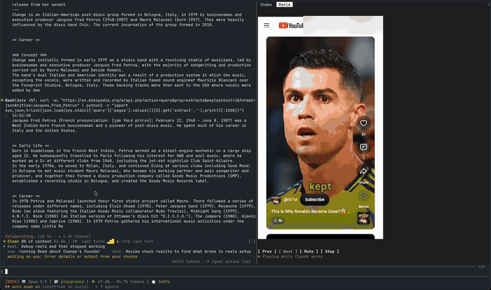
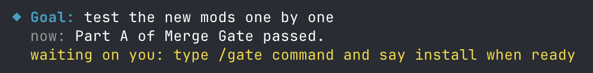
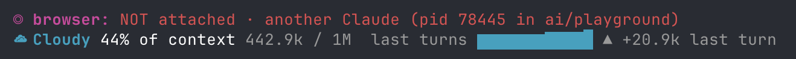
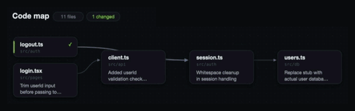

<p align="center"></p>

<h1 align="center">Claude Code mods</h1>

<p align="center"><b>Make Claude Code show what it's doing.</b><br>Plugins for Claude Code, built on function hooks: live lines above the prompt, guards, panes and games. Install only the ones you want.</p>

<p align="center">
  <a href="LICENSE"></a>
  <a href="https://github.com/hamzafer/claude-code-mods/actions/workflows/ci.yml"></a>
</p>

<p align="center">
  <a href="#-install">Install</a> · <a href="#-the-mods">All mods</a> · <a href="docs/mods.md">Docs</a> · <a href="https://claude.dev/blog/getting-started-with-claude-code-mods/">What are mods?</a>
</p>

<table>
  <tr>
    <td align="center" width="33%"><a href="docs/mods.md#-context-bar"></a><br>📊 <b>context-bar</b><br>what fills your context</td>
    <td align="center" width="33%"><a href="docs/mods.md#-review-watch"></a><br>🔍 <b>review-watch</b><br>running code reviews, live</td>
    <td align="center" width="33%"><a href="docs/mods.md#-md-preview"></a><br>📝 <b>md-preview</b><br>Markdown rendered like GitHub</td>
  </tr>
  <tr>
    <td align="center" width="33%"><a href="docs/mods.md#-blast-radius"></a><br>💥 <b>blast-radius</b><br>see what <code>rm -rf</code> would delete</td>
    <td align="center" width="33%"><a href="docs/mods.md#-now-playing"></a><br>🎵 <b>now-playing</b><br>Spotify and its lyrics, live</td>
    <td align="center" width="33%"><a href="docs/mods.md#-reels-and-snake"></a><br>📱 <b>reels</b><br>Shorts while Claude works</td>
  </tr>
  <tr>
    <td align="center" width="33%"><a href="docs/mods.md#-where-am-i"></a><br>📍 <b>where-am-i</b><br>goal, now, waiting on you</td>
    <td align="center" width="33%"><a href="docs/mods.md#-lines-above-the-prompt"></a><br>🌦️ <b>token-weather and friends</b><br>lines above the prompt</td>
    <td align="center" width="33%"><a href="#mission-control"></a><br>🛰️ <b>mission-control</b><br>agents and the code they touch</td>
  </tr>
</table>

## 🚀 Install

Add the marketplace once, then install any mod by name:

```sh
claude plugin marketplace add hamzafer/claude-code-mods
claude plugin install context-bar@claude-code-mods
```

Or install the general-purpose set in one go:

```sh
for m in context-bar token-weather usage-meter where-am-i next-steps agent-radar review-watch replay-theater md-preview blast-radius mission-control; do
  claude plugin install "$m@claude-code-mods"
done
```

Restart Claude Code after installing. To try one without installing:

```sh
git clone https://github.com/hamzafer/claude-code-mods && cd claude-code-mods
claude --plugin-dir mods/context-bar
```

> **Needs** Claude Code 2.1.287+. A few mods need more (Chrome, `gh`, a connector); the tables say which.

## 🧩 The mods

### 👀 See what's happening

| | Mod | What it does | Command |
| --- | --- | --- | --- |
| 🛰️ | **mission-control** | Live map of agents, tool calls and the code they touch | `/mission` |
| 📊 | **context-bar** | Your context window as one stacked bar, a color per category, with token counts and where it compacts | `/context-bar` |
| 🌦️ | **token-weather** | Context fill from Clear to Compact soon, plus a prompt-cache countdown | |
| ⏱️ | **cache-clock** | A prompt-cache line under your status line, from Claude Code's own figures: time left, hit rate and misses, and the tokens your next message re-caches once it goes cold. Needs Node and Claude Code 2.1.251+ | `/cache-clock setup` |
| 📍 | **where-am-i** | Goal, doing now, waiting on you, next step | `/where` |
| ➡️ | **next-steps** | 2 or 3 likely next prompts after each turn, one key to draft one | `1` `2` `3`, `0` hides |
| 💰 | **usage-meter** | 5-hour and 7-day plan usage, the reset countdown and the session's cost | |
| 💳 | **openai-balance** | Your OpenAI API credit: an estimated balance with a gauge, today's spend, where the money mostly went, and the last call. Needs an OpenAI organization Admin key | `/openai-balance` |
| 📡 | **agent-radar** | One live line per running subagent | `/radar` |
| 🔍 | **review-watch** | One live line per running code review (Codex or a review subagent) with the model, target, elapsed time and Codex's latest output. A toast lists the findings when it ends | |
| 🌐 | **browser-lanes** | Whether this session has a browser, and who holds it | `/browser` |
| 🕌 | **prayer-times** | The current prayer and how long is left, the next one, and zawal. Computed on your computer, Hanafi or standard Asr | `/prayers` |
| 🎬 | **replay-theater** | Steps through the last turn's edits, one diff at a time | `/replay` |
| 📝 | **md-preview** | Renders the Markdown files Claude edits like GitHub does, with before and after side by side. Needs Chrome and a terminal that shows images | `/md` |
| 🏷️ | **last-prompt-title** | Retitles the session on every prompt, so the sidebar says what each session is doing now. A short title Haiku writes, on the desktop app | |

### 🛡️ Guard your repo

| | Mod | What it does | Command |
| --- | --- | --- | --- |
| 💥 | **blast-radius** | Holds `rm -r`, force pushes and migrations, shows what they'd delete, cancels after 60 s with no answer | |

### 💸 Spend less

| | Mod | What it does | Command |
| --- | --- | --- | --- |
| 🔀 | **switchboard** | Picks the model for each subagent that doesn't name one, with [OpenAI's Decisions API](https://developers.openai.com/api/docs/guides/decisions) or [Jev](https://docs.typesafe.ai), from its short label only. Shows what every subagent cost | `/route` |

### 🔧 My setup (fork and adapt)

These are built around my own tools and rules. Fork them and change the rules to yours.

| | Mod | What it does | Command |
| --- | --- | --- | --- |
| 👀 | **glance** | One line with what needs you: next meeting, PRs, Linear issues, Slack DMs. Needs `gh` and the Google Calendar, Linear and Slack connectors | `/glance` |
| 🚦 | **merge-gate** | Holds `gh pr merge` until CI is green and Codex reviewed once. Needs `gh` and the Codex CLI. Reviews run on one fixed model; change it to yours | `/gate` |
| 📏 | **rulebook-guard** | Enforces my writing and git rules: rewrites em dashes, asks before `--amend`, unformatted pushes, emails and phone numbers in notes | |
| 💾 | **session-saver** | Saves where you left off, shows it on resume. Needs [unpause](https://github.com/hamzafer/unpause) | `/park [note]` |

### 🎮 For fun (opt-in)

| | Mod | What it does | Command |
| --- | --- | --- | --- |
| 📱 | **reels** | YouTube Shorts while Claude works, pauses when it's done | `/reels` |
| 🐍 | **snake** | Snake while Claude works | `/snake` |
| 🎵 | **now-playing** | What Spotify is playing, with a progress bar, the lyric being sung, and ⏮ ⏸ ⏭ buttons. Needs macOS and the Spotify app | `/music` |

<a id="mission-control"></a>

## 🛰️ Flagship: mission-control

Every subagent, every tool call and every file they touch, in a pane next to the chat. Shown at 4x: two subagents building a logout feature across four files.


Install it like any mod, restart, and type `/mission` (or `/mission code` to open the code map). `q` closes it.

- 🤖 `w` shows the agents and every tool call, live
- 🗺️ `c` shows the code map, with import arrows
- 🔵 **Blue** while the agent reads a file
- 🟠 **Orange** while it writes
- 🟢 **Green** when done, with one line on what changed

> The Code view also needs macOS, Google Chrome and a terminal that shows images (Ghostty, kitty, iTerm2). The Who view works everywhere.

## 📚 More

- 📖 [**docs/mods.md**](docs/mods.md): how they behave, setup notes and build your own
- 🎥 [**docs/demo.md**](docs/demo.md): videos and screenshots
- ⭐ Earlier project: [**cursor-commands**](https://github.com/hamzafer/cursor-commands) [](https://github.com/hamzafer/cursor-commands), 600+ stars for Cursor slash commands
- 🤝 [**CONTRIBUTING.md**](CONTRIBUTING.md): add your own mod
