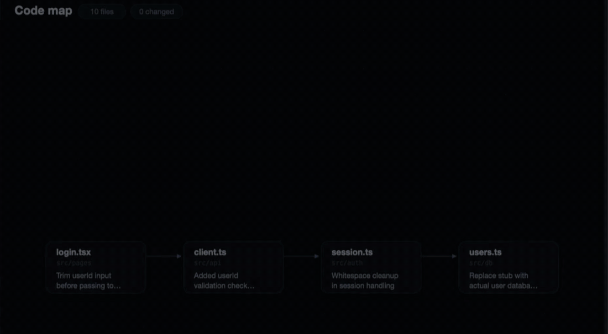

# 🛰️ Claude Code mods

[](LICENSE)
[](https://github.com/hamzafer/claude-code-mods/actions/workflows/ci.yml)

**See what your agent is reading and writing, live.**

Mods are Claude Code plugins that add live UI and hooks to a session (Claude Code 2.1.287+). [What are mods?](https://claude.dev/blog/getting-started-with-claude-code-mods/)

mission-control draws every subagent, every tool call and every file they touch, in a pane next to the chat.



## 🚀 Try mission-control

```sh
claude plugin marketplace add hamzafer/claude-code-mods
claude plugin install mission-control@claude-code-mods
```

Restart Claude Code and type `/mission` (or `/mission code` to open the code map). `q` closes it.

- 🤖 `w` shows the agents and every tool call, live
- 🗺️ `c` shows the code map, with import arrows
- 🔵 **Blue** while the agent reads a file
- 🟠 **Orange** while it writes
- 🟢 **Green** when done, with one line on what changed

> **Needs** Claude Code 2.1.287+. The Code view also needs macOS, Google Chrome and a terminal that shows images (Ghostty, kitty, iTerm2). The Who view works everywhere.

## 🧩 The mods

### 👀 See what's happening

| | Mod | What it does | Command |
| --- | --- | --- | --- |
| 🛰️ | **mission-control** | Live map of agents, tool calls and the code they touch | `/mission` |
| 🌦️ | **token-weather** | Context fill from Clear to Compact soon, plus a prompt-cache countdown | |
| 📍 | **where-am-i** | Goal, doing now, waiting on you, next step | `/where` |
| ➡️ | **next-steps** | 2 or 3 likely next prompts after each turn, one key to draft one | `1` `2` `3`, `0` hides |
| 💰 | **usage-meter** | 5-hour and 7-day plan usage, the reset countdown and the session's cost | |
| 📡 | **agent-radar** | One live line per running subagent | `/radar` |
| 🌐 | **browser-lanes** | Whether this session has a browser, and who holds it | `/browser` |
| 🎬 | **replay-theater** | Steps through the last turn's edits, one diff at a time | `/replay` |
| 📝 | **md-preview** | Shows the Markdown files Claude edits, rendered like GitHub, before and after side by side. Needs Chrome and a terminal that shows images | `/md` |

### 🛡️ Guard your repo

| | Mod | What it does | Command |
| --- | --- | --- | --- |
| 💥 | **blast-radius** | Holds `rm -r`, force pushes and migrations, shows what they'd delete, cancels if nobody answers in time | |

### 🔧 My setup (fork and adapt)

These are built around my own tools and rules. Fork them and change the rules to yours.

| | Mod | What it does | Command |
| --- | --- | --- | --- |
| 👀 | **glance** | One line with what needs you: next meeting, PRs, Linear issues, Slack DMs. Needs `gh` and the Google Calendar, Linear and Slack connectors | `/glance` |
| 🚦 | **merge-gate** | Holds `gh pr merge` until CI is green and Codex reviewed once. Needs `gh` and the Codex CLI. Reviews run on one fixed model; change it to yours | `/gate` |
| 📏 | **rulebook-guard** | Enforces my writing and git rules: rewrites em dashes, asks before `--amend`, unformatted pushes, emails and phone numbers in notes | |
| 💾 | **session-saver** | Saves where you left off, shows it on resume. Needs [unpause](https://github.com/hamzafer/unpause) | `/park [note]` |

### 🎮 For fun (opt-in)

| | Mod | What it does | Command |
| --- | --- | --- | --- |
| 📱 | **reels** | YouTube Shorts while Claude works, pauses when it's done | `/reels` |
| 🐍 | **snake** | Snake while Claude works | `/snake` |

## 📦 Install any mod

Same two commands, with the mod's name in place of `mission-control`. Or try one without installing:

```sh
git clone https://github.com/hamzafer/claude-code-mods && cd claude-code-mods
claude --plugin-dir mods/token-weather
```

## 📚 More

- 📖 [**docs/mods.md**](docs/mods.md): how they behave, setup notes and build your own
- 🎥 [**docs/demo.md**](docs/demo.md): videos and screenshots
- ⭐ Earlier project: [**cursor-commands**](https://github.com/hamzafer/cursor-commands) [](https://github.com/hamzafer/cursor-commands), 600+ stars for Cursor slash commands
- 🤝 [**CONTRIBUTING.md**](CONTRIBUTING.md): add your own mod
