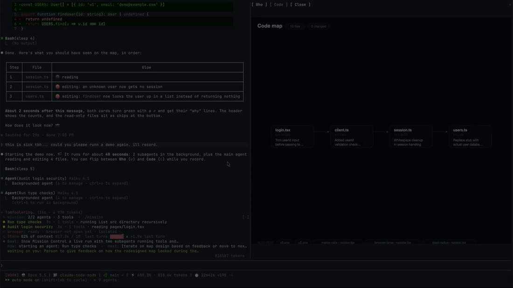

# Demo

Videos and screenshots of the mods. The overview is in the [README](../README.md), setup notes in [mods.md](mods.md).

**mission-control** at 4x: two subagents and a logout feature landing across four files

**reels** plays Shorts while Claude works and pauses when it's done

**browser-lanes, token-weather and where-am-i** stacked above the prompt

**blast-radius** holds an `rm -rf` and shows what it would delete

**rulebook-guard** catches a `git commit --amend`

**replay-theater** steps through the last turn's edits

**where-am-i** with token-weather above it

