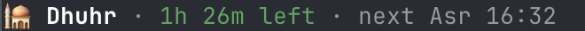
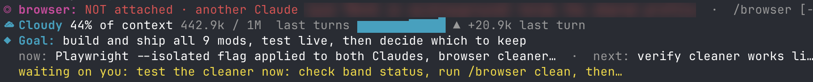
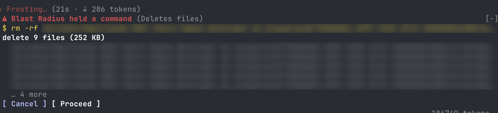
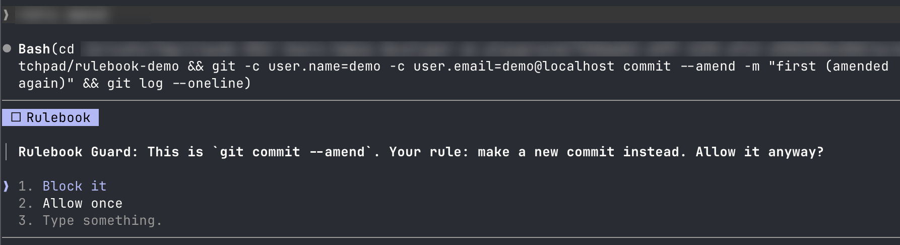
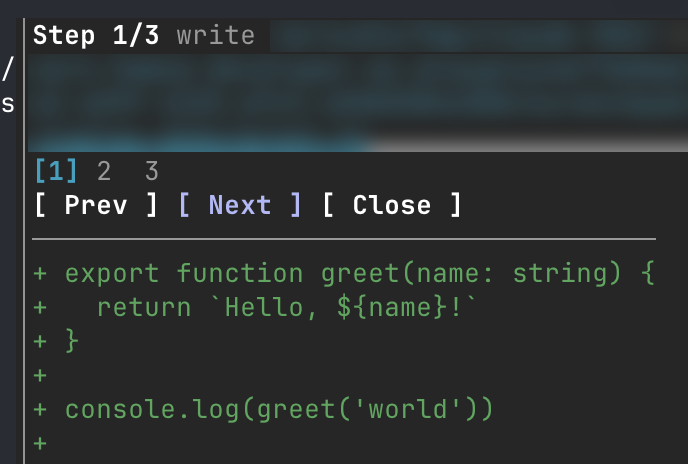
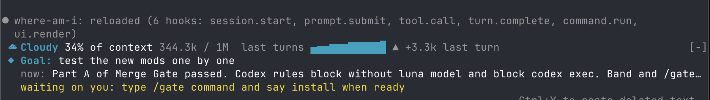

# 🎥 Demo

🏠 Back to the [README](../README.md), or read the [setup notes](mods.md).

## 🛰️ mission-control

Shown at 4x: two subagents building a logout feature across four files.

## 📊 context-bar

What fills the context window, one color per category.

## 🔍 review-watch

A Codex review and a review subagent running at once.

## 📝 md-preview

The diff Claude wrote on the left, the page rendered like GitHub on the right.

## 🕌 prayer-times

The current prayer, the time left, and the next one.

## 🎵 now-playing

The Spotify track with its progress, the ⏮ ⏸ ⏭ buttons, and the lyric being sung on the line below.

## 📱 reels

Plays Shorts while Claude works and pauses when it's done.

## 📚 Lines above the prompt

browser-lanes, token-weather and where-am-i stacked above the prompt.

## 💥 blast-radius

Holds an `rm -rf` and shows what it would delete.

## 📏 rulebook-guard

Catches a `git commit --amend`.

## 🎬 replay-theater

Steps through the last turn's edits.

## 📍 where-am-i

Shown with token-weather above it.

